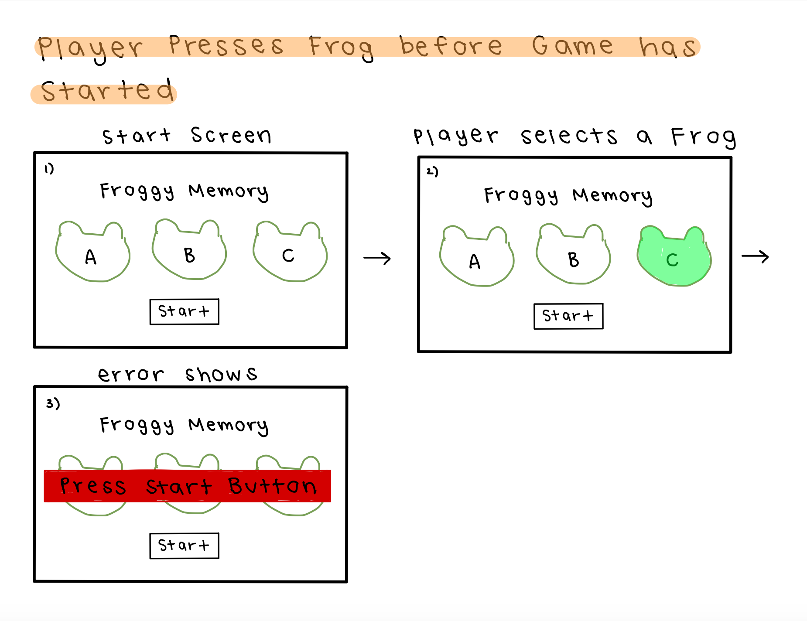

# Froggy Memory

## Description
Froggy Memory is an interactive game where the player will try their best to follow a computer generated pattern.

## Overview
Froggy Memory is a memory game that makes the player copy a pattern based on a random computer-generated pattern. First, the computer indicates one of the four options, and then the player will choose the option that the computer displayed. The pattern will build up with each turn, and a score tracker will keep a count of the number of turns until the player messes up. After this, the game will end and there will be a tracker that shows the player’s high score. 

## High-Level Design
### Flowchart

### Methods:
I have broken down the program into 4 methods:
- static Bool PlaySequence();
- static Bool PlayerGuess(colors);
- static void HighlightFrog(); 
- static List GenerateColor(List<string> possible);
  
### Bool PlaySequence()
This sequence gets a random color and highlights the corresponding frog. 

1. Generate the current color
2. Use the Highlight frog method 
3. Move on to the next color in the sequence
4. Return until current color is less than the sequence count

### Bool PlayerGuess(colors)
This method checks the input of the player's answer and sees if it correctly corelate to the programed pattern. If the player is right, it will add another color to the program. Otherwise, the game ends. 

1. If the color guessed is the same as the current color, move to the next color in the sequence and high light the corresponding frog
2. Otherwise, the game is over
3. If the current color is greater than or equal to the sequence count, set the current color to 0, add a new generated color, and play sequence

### Void HighlightFrog(); 
The corresponding frog to its letter is chosen making it light up and play a sound. 

1. If a certain letter is chosen, 
   - make the corresponding color frog light up 
   - and play a sound.

### List GenerateColor(List<frogs> possible);
This method let the player choose the number of colors/frogs they want in their game. 

1. Set an integer equal to a list from 0 to the possible number of frogs
2. Let there be a number of colors that is equal to this possible integer
3. Add this color to the sequence 

## Method Tests
### Expected Game Play
.png)
.png)
.png)

### Start Button in the Middle of the Game

### Player Presses Frog Before Game has Started

### Player Guesses too Many Times

### Player Guesses when Sequence is Being Shown

